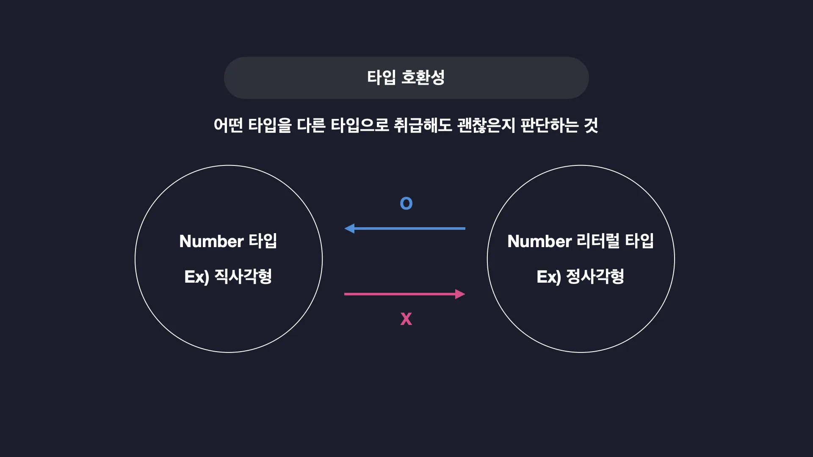
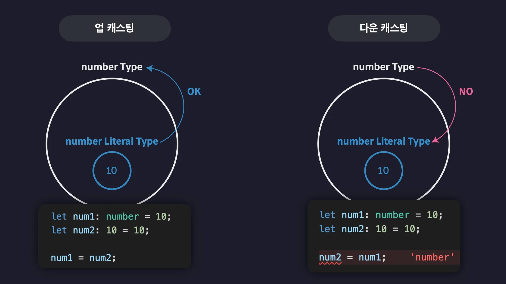

## 타입은 집합이다
### 타입 호환성


```ts
let num1: number = 30;
let num2: 10 = 10;

num1 = num2;
num2 = num1; // ❌
```

### 업 캐스팅과 다운 캐스팅
- **✅ 업 캐스팅** 서브 타입의 값을 슈퍼 타입의 값으로 취급 (ex. 10 => `number` / 숫자 10은 `number`에 포함되므로)
- **❌ 다운 캐스팅** 슈퍼 타입의 값을 서브 타입의 값으로 취급 (ex. `number` => 10)



<br>

## 타입 계층도
