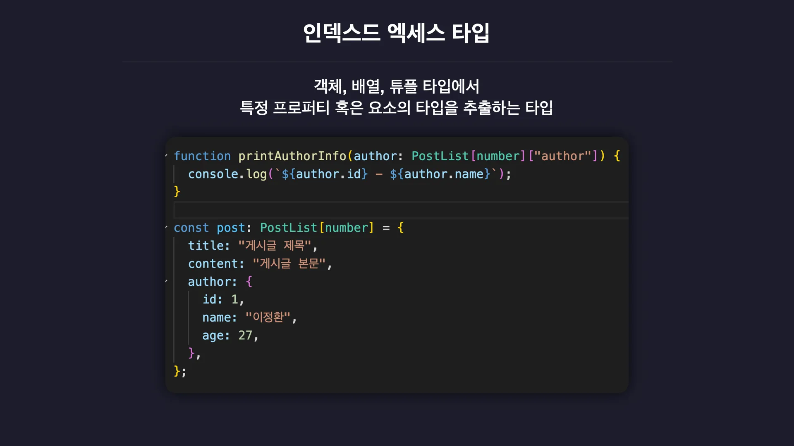
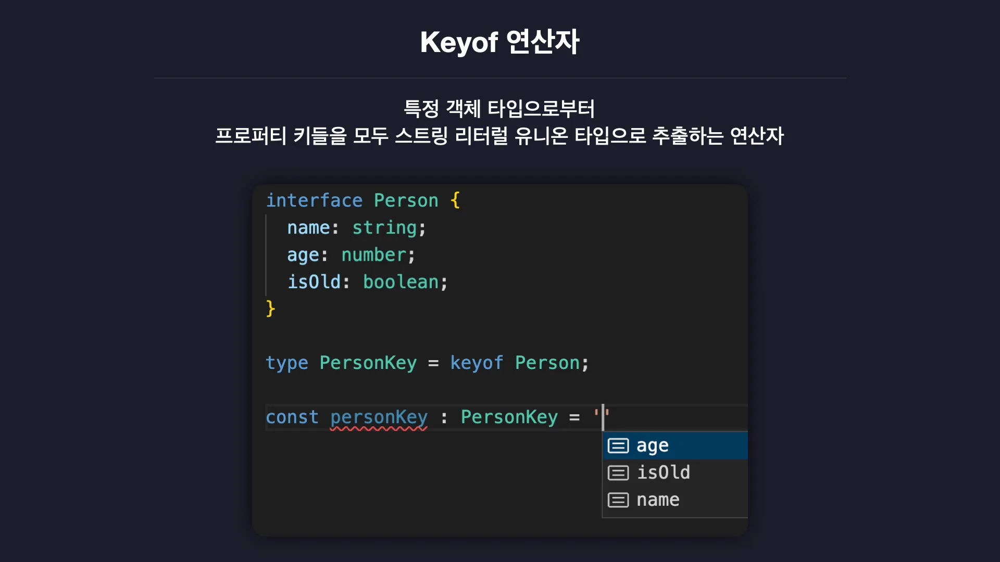
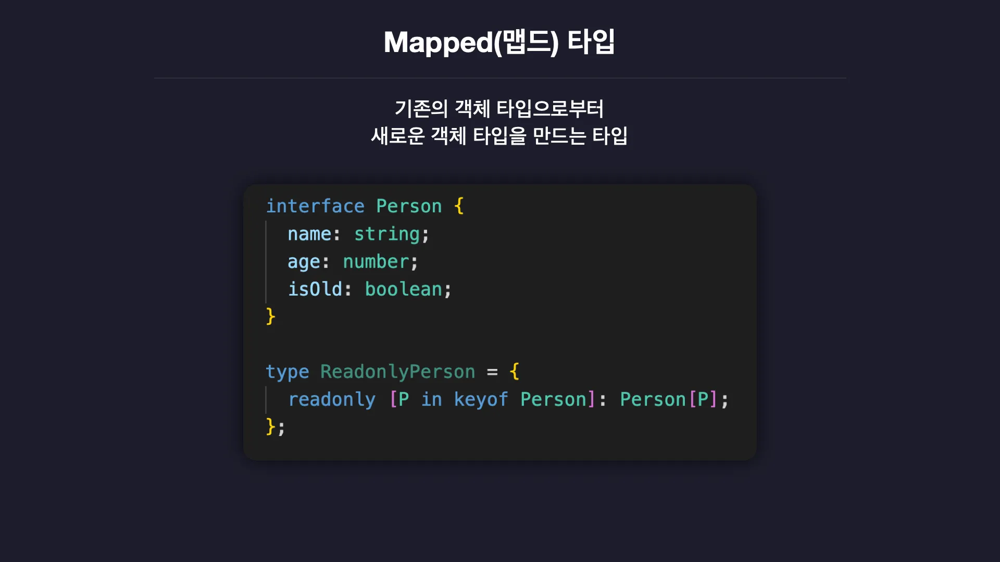
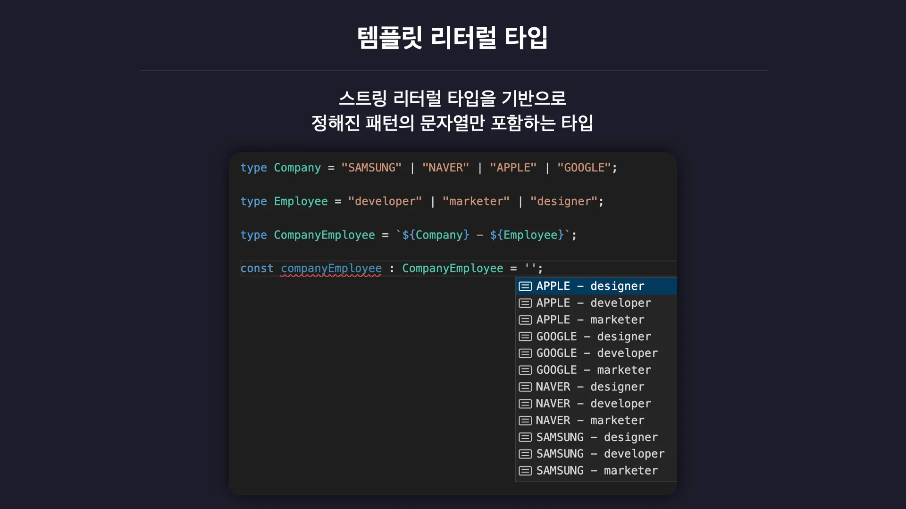

# 타입 조작하기

## 인덱스드 엑세스 타입
객체, 배열, 튜플 타입으로부터 특정 프로퍼티나 특정 요소의 타입만 추출

## Keyof 연산자
객체 타입으로부터 해당 타입 내에 정의된 프로퍼티의 키들을 유니온 타입으로 추출

## Mapped(맵드) 타입
마치 자바스크립트의 맵 함수처럼 기존의 객체 타입을 기반으로 새로운 객체 타입을 만듦

## 템플릿 리터럴 타입
기존의 스트링 리터럴 타입을 기반으로 정해진 패턴의 문자열만 포함

